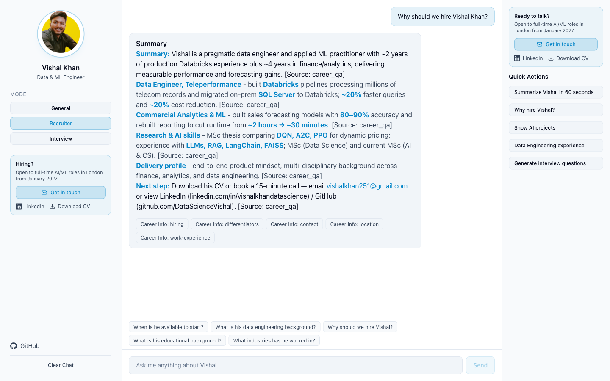
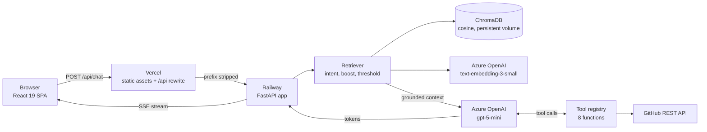
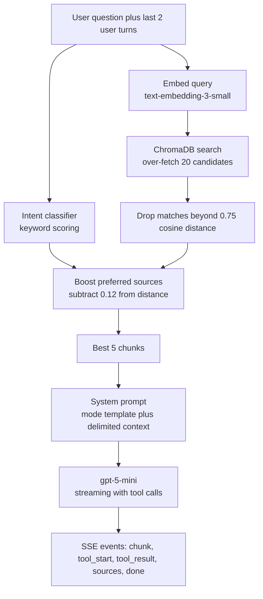

<div align="center">

# AI Digital Twin

**A RAG-powered professional assistant that answers recruiter and technical-interview questions about Vishal Khan — grounded in a curated knowledge base, with source citations on every answer.**

[](https://ai-professional-twin.vercel.app)

[](https://github.com/DataScienceVishal/ai-professional-twin/actions/workflows/ci.yml)
[](https://www.python.org/)
[](https://fastapi.tiangolo.com/)
[](https://react.dev/)
[](https://www.typescriptlang.org/)
[](https://azure.microsoft.com/en-us/products/ai-services/openai-service)
[](https://www.trychroma.com/)

### [→ Try it live at ai-professional-twin.vercel.app](https://ai-professional-twin.vercel.app)

No signup. Pick a mode, ask a question, watch the answer stream in with its sources.

</div>

<!--
  Screenshot lives at docs/screenshot.png. To swap in a short screen-capture
  GIF of a live answer streaming in, drop it at docs/demo.gif and point the
  line below at it.
-->


---

## What it does

- **Answers questions about one person, from evidence.** Every response is generated from a curated knowledge base — YAML files covering projects, skills, education, certifications and career Q&A, plus the resume PDF and live data pulled from public GitHub repositories. **87 documents are indexed** in the running deployment.
- **Shows its working.** Each answer ends with the source chunks it was built from, so you can see whether a claim came from the resume, the academic record, or a repository README.
- **Three modes for three audiences.** *General* is conversational, *Recruiter* returns a one-line summary plus quantified bullets under 150 words, and *Interview* goes deep on architecture and trade-offs — and renders Mermaid diagrams inline when it explains a system.
- **Calls tools when static text is not enough.** Eight function-calling tools let the model fetch live repository stats, search repos, compute years of experience, count projects by category, and hand back a resume download link.
- **Declines rather than guesses.** The system prompt forbids fabrication, keeps the assistant inside professional scope, and treats retrieved text as data rather than instructions.

## Ask it things like

| General | Recruiter | Interview |
| --- | --- | --- |
| Tell me about Vishal | Summarize Vishal as a candidate in 60 seconds | Explain the RAG architecture in this project |
| What projects has he built? | Will he require visa sponsorship? | What chunking strategy did you use and why? |
| What is his MSc thesis about? | When is he available to start? | Why did you choose dense vector search over BM25? |
| What databases has he worked with? | How has he demonstrated impact in previous roles? | How do you handle prompt injection? |
| What is his experience with RAG systems? | What is his data engineering background? | What would you change about this architecture? |

The UI shuffles a rotating set of these as suggestion chips; the full list lives in [`frontend/src/lib/constants.ts`](frontend/src/lib/constants.ts).

## Architecture



The browser only ever talks to its own origin. Vercel rewrites `/api/:path*` to the Railway host with the `/api` prefix stripped, so the FastAPI routes stay unprefixed (`/chat`, `/projects`, `/skills`, `/health`, `/ready`, `/resume/download`) and **there is no CORS in production**. [`frontend/vite.config.ts`](frontend/vite.config.ts) mirrors the same rewrite for local development, so dev and prod behave identically and no build-time env var is needed.

| Endpoint | Method | Purpose |
| --- | --- | --- |
| `/chat` | POST | SSE stream of answer chunks, tool activity and sources |
| `/projects`, `/projects/{slug}` | GET | Portfolio data straight from `projects.yaml` |
| `/skills` | GET | Skill categories from `skills.yaml` |
| `/resume/download` | GET | Resume PDF |
| `/health` | GET | Liveness. Dependency-free, answers during cold start |
| `/ready` | GET | Readiness. 503 until the store has documents; reports the count |

Splitting liveness from readiness matters: the platform health check points at `/health`, because `/ready` returns 503 until ingestion finishes and would restart-loop a cold boot.

<details>
<summary><b>How the RAG pipeline works</b> — ingestion, retrieval, generation</summary>

<br/>



### Ingestion

Each knowledge source has a purpose-built chunker in [`backend/app/rag/chunker.py`](backend/app/rag/chunker.py) rather than a generic fixed-window splitter — a project, a skill category, a Q&A pair, a certificate, a degree with its modules, a resume page and a GitHub repo each become one semantically complete document with typed metadata.

Ingestion runs as a background asyncio task started from the lifespan handler, not inline on startup. Before embedding, every document gets a SHA-256 hash of its text and metadata; that hash is stored **in the document's own Chroma metadata**, so the persisted collection *is* the manifest and there is no second file that can drift out of sync with the vectors it describes. Only changed documents are re-embedded, and each pass may only delete documents from the sources it owns — so a skipped GitHub pass can never wipe the GitHub documents. Embeddings go out in batches of 64.

GitHub ingestion is best-effort: READMEs are fetched concurrently with a semaphore, individual failures are logged and skipped, and a total failure marks the run `github_skipped` and continues with local knowledge only.

### Retrieval

| Knob | Value | Where |
| --- | --- | --- |
| Chunks passed to the model | 5 | `Retriever.top_k` |
| Candidates fetched from Chroma | `top_k × 4` | `OVERFETCH_FACTOR` |
| Relevance cutoff | 0.75 cosine distance | `MAX_DISTANCE` |
| Preferred-source boost | 0.12 subtracted from distance | `SOURCE_BOOST` |
| Prior user turns folded into the query | 2 | `HISTORY_TURNS` |

A keyword classifier sorts the query into one of five intents (projects, skills, experience, education, general). The intent does **not** filter the search — it selects a set of preferred sources whose distances are nudged down during ranking. Weak matches are dropped by the threshold first; if *everything* scores badly the single best match is kept anyway, so the assistant says "I don't have that" from the prompt rules rather than from an empty context.

Follow-up questions like *"what tools did he use?"* embed to almost nothing on their own, so the last two user turns are prepended to the retrieval query. That is cheaper and more predictable than an extra LLM condensation round trip.

### Generation

The system prompt is assembled per request from three parts: a base identity with hard scope and anti-fabrication rules, a mode-specific formatting template, and the retrieved context wrapped in `<retrieved_context>` tags with an explicit instruction that everything inside is untrusted data. Response rules require `[Source: X]` citations and a Mermaid diagram whenever an architecture is explained.

Generation streams over SSE. The tool loop runs up to three rounds of tool calls, emitting `tool_start` and `tool_result` events so the UI can show what the model is doing mid-answer, then `sources` and `done`. Token usage is requested via `stream_options` and logged server-side for cost tracking — it is never forwarded to the browser. Failures mid-stream are caught, logged with the exception type, and replaced with a safe user-facing message so the connection never dies with a blank bubble.

</details>

<details>
<summary><b>Engineering decisions</b> — the reasoning behind the non-obvious parts</summary>

<br/>

**Source boosting, not metadata filtering.** The obvious design is to classify intent and then hard-filter Chroma on `where={"source": ...}`. That was the original implementation and it was wrong: every education query filtered down to sources that excluded `academics.yaml`, which is exactly the file holding the answer. Retrieval now queries unfiltered, over-fetches four times the needed chunks, and subtracts a small constant from the distance of preferred sources. Intent influences ranking; it can never hide a document.

**Background ingestion instead of blocking startup.** Re-embedding the knowledge base and serially fetching repository READMEs during startup blew past the platform health-check window. The container got killed, restarted, and re-ran the whole thing — a crash loop that billed embedding calls on every pass. Ingestion is now an `asyncio` task held on `app.state`, so `/health` answers immediately on a cold start, `/ready` reports honest progress, and an upstream outage degrades the service instead of killing it. The same principle applies to missing credentials: the app logs the misconfiguration and stays up with chat disabled rather than failing to boot.

**Content-hash manifest in the vectors themselves.** Documents are only embedded when their SHA-256 changes. Keeping the hash in Chroma metadata rather than a sidecar file means the manifest cannot disagree with the collection it describes. In production this needs a mounted volume for the Chroma directory — without one the store is wiped on restart and every cold boot pays for a full re-embed.

**Retrieved context is untrusted input.** Part of the knowledge base is ingested automatically from public GitHub READMEs, which is a live prompt-injection surface. Context is delimited in `<retrieved_context>` tags, the prompt states that everything inside is data rather than instructions, and the response rules repeat the constraint and forbid echoing any injected instruction back to the user. Neither is a guarantee, but the alternative — pasting third-party markdown straight into the system prompt — is strictly worse.

**Two independent cost controls.** A per-IP `slowapi` limit (10 requests/minute on `/chat`, 60/minute elsewhere) stops one visitor hammering the endpoint, and a global daily completion budget caps total spend across all visitors. Exhausting the budget returns a polite SSE message pointing at the contact link instead of a 500. The budget counter is in process memory, so with multiple replicas the effective cap is `budget × replicas` — documented in the code, and fine for a single-instance personal site.

**Temperature is omitted for GPT-5-family models.** GPT-5 and o-series deployments reject any non-default temperature with an HTTP 400, and take the output cap as `max_completion_tokens` rather than `max_tokens`. The client detects the family from the model name and adjusts both, with `LLM_SEND_TEMPERATURE` available to override the heuristic when a deployment disagrees.

**The frontend fails loudly on a misrouted API.** Vercel reserves `/api/*` for serverless functions, so a missing or mis-ordered rewrite makes every API call return `index.html` with a 200. The SSE parser would then yield zero events and the chat would produce a silent empty reply. `streamChat` asserts the response `content-type` is `text/event-stream` and throws a message naming the likely cause instead.

</details>

## Tech stack

| Layer | Choice | Notes |
| --- | --- | --- |
| API | FastAPI on Python 3.12 | App factory + lifespan, `uv` for dependency management |
| LLM | Azure OpenAI `gpt-5-mini` | Streaming chat completions with function calling |
| Embeddings | Azure OpenAI `text-embedding-3-small` | Batched, 64 texts per request |
| Vector store | ChromaDB | Persistent client, cosine distance |
| Streaming | `sse-starlette` | Typed SSE events consumed by a hand-rolled reader |
| Throttling | `slowapi` + in-process daily budget | Per-IP limits and a global spend ceiling |
| Logging | `structlog` | One structured `chat_query` event per request |
| Frontend | React 19, Vite, TypeScript, Tailwind CSS 4 | `react-markdown` + `rehype-highlight`, `framer-motion` |
| Diagrams | `mermaid` | Rendered client-side in Interview mode |
| Tests | pytest + `pytest-asyncio`, Vitest + Testing Library | 178 tests total |
| Quality | ruff, mypy (strict), oxlint, `tsc` | All enforced in CI |
| Hosting | Railway (backend, Docker), Vercel (frontend) | Same-origin via rewrite |

## Local development

Prerequisites: Python 3.12, [uv](https://docs.astral.sh/uv/), Node 20+.

**Backend**

```bash
cd backend
cp .env.example .env      # add your Azure OpenAI endpoint and key
uv sync --extra dev
uv run uvicorn app.main:create_app --factory --reload --port 8000
```

**Frontend** (in a second terminal)

```bash
cd frontend
npm install
npm run dev
```

Then open http://localhost:5173. The Vite dev server proxies `/api/*` to `http://localhost:8000` with the prefix stripped, mirroring the Vercel rewrite — **no frontend environment variable is required**. `VITE_API_URL` exists only as an escape hatch for pointing a local UI at a deployed backend.

Without Azure credentials the app still boots and serves `/health`, `/projects` and `/skills`; `/ready` will report the misconfiguration and chat will be disabled.

<details>
<summary><b>Configuration</b> — environment variables and defaults</summary>

<br/>

Backend variables are read by [`backend/app/config.py`](backend/app/config.py) from the environment or a local `.env`. See [`backend/.env.example`](backend/.env.example) for an annotated template. Never commit real values.

| Variable | Default | Purpose |
| --- | --- | --- |
| `AZURE_OPENAI_ENDPOINT` | *(empty)* | Azure OpenAI / AI Foundry resource endpoint |
| `AZURE_OPENAI_API_KEY` | *(empty)* | API key. Without it, chat and embeddings are disabled |
| `AZURE_OPENAI_API_VERSION` | `2024-10-21` | Azure API version |
| `LLM_MODEL` | `gpt-5-mini` | Chat deployment name |
| `EMBEDDING_MODEL` | `text-embedding-3-small` | Embedding deployment name |
| `LLM_TEMPERATURE` | `0.3` | Ignored for GPT-5 / o-series deployments |
| `LLM_SEND_TEMPERATURE` | *(unset — auto)* | Force the temperature parameter on or off |
| `LLM_MAX_OUTPUT_TOKENS` | `1024` | Completion cap; sent under the right key per model family |
| `LLM_STREAM_USAGE` | `true` | Request token counts on streamed responses for cost logs |
| `GITHUB_TOKEN` | *(empty)* | Enables GitHub ingestion and the live repo tools |
| `GITHUB_USERNAME` | `DataScienceVishal` | Account queried by the GitHub tools |
| `INGEST_GITHUB` | `true` | Set `false` to cut cold-start time and embedding cost |
| `GITHUB_REPO_LIMIT` | `100` | Maximum repositories fetched per ingestion pass |
| `GITHUB_CONCURRENCY` | `5` | Parallel README fetches |
| `CHROMA_PERSIST_DIR` | `./chromadb_data` | Vector store path. The Docker image sets `/data/chromadb` |
| `CORS_ORIGINS` | `http://localhost:5173` | Comma-separated frontend origins |
| `PUBLIC_BASE_URL` | `http://localhost:8000` | Public origin of *this* API, used to build resume links |
| `RATE_LIMIT` | `60/minute` | Default per-IP limit for read-only endpoints |
| `CHAT_RATE_LIMIT` | `10/minute` | Per-IP limit for `/chat` |
| `DAILY_CHAT_BUDGET` | `500` | Global completions per UTC day, across all visitors |
| `LOG_LEVEL` | `info` | structlog level |

Frontend: only `VITE_API_URL` exists, it is optional, and it defaults to the same-origin `/api` prefix. See [`frontend/.env.example`](frontend/.env.example).

In production, `CHROMA_PERSIST_DIR` must point at a mounted volume. Without one, the vector store is wiped on every restart and the content-hash manifest cannot prevent a full re-embed on each cold boot.

</details>

## Testing and quality

Both suites run on every push and pull request to `main` via [`.github/workflows/ci.yml`](.github/workflows/ci.yml).

**Backend** — 146 tests

```bash
cd backend
uv run ruff check .          # lint
uv run ruff format --check . # formatting
uv run mypy app/             # strict type checking (configured in pyproject.toml)
uv run pytest -q             # 146 passed
```

**Frontend** — 32 tests

```bash
cd frontend
npm run lint       # oxlint
npm run typecheck  # tsc -b
npm run test       # vitest run - 32 passed
npm run build      # tsc -b && vite build
```

**178 tests total.** The pytest suite mirrors the `app/` tree — chunkers, embedding batching, the Chroma store and manifest, retriever ranking and intent classification, prompt assembly, every router, the LLM client's parameter handling and tool loop, the rate limiter and daily budget, and each tool. The Vitest suite covers the SSE client (including events split across chunk boundaries and the `content-type` guard), the chat hook's streaming state machine, and the suggestion-chip logic.

## Project structure

```
.
├── backend/
│   ├── app/
│   │   ├── main.py          # app factory, lifespan, background ingestion task
│   │   ├── config.py        # pydantic-settings; every env var lives here
│   │   ├── ingest.py        # content-hash sync of sources into the vector store
│   │   ├── rate_limit.py    # per-IP limiter + global daily completion budget
│   │   ├── models/          # pydantic request and response models
│   │   ├── prompts/         # base identity, per-mode templates, response rules
│   │   ├── rag/             # chunker, embeddings, Chroma store, retriever
│   │   ├── routers/         # chat, health + ready, projects/skills/resume
│   │   ├── services/        # Azure OpenAI client, GitHub REST client
│   │   └── tools/           # function-calling tools and their JSON schemas
│   ├── knowledge/           # YAML knowledge base + resume PDF
│   ├── tests/               # pytest suite, mirrors app/
│   ├── Dockerfile           # multi-stage uv build
│   └── railway.toml         # health check + volume notes
├── frontend/
│   ├── src/
│   │   ├── components/      # chat, layout, modes, projects, ui
│   │   ├── hooks/           # use-chat (SSE state machine), use-projects
│   │   ├── lib/             # api client, constants, shared types
│   │   └── pages/
│   ├── vercel.json          # /api rewrite to Railway, then SPA fallback
│   └── vite.config.ts       # dev proxy mirroring the Vercel rewrite
└── .github/workflows/ci.yml
```

<details>
<summary><b>Roadmap and known limitations</b></summary>

<br/>

- **Retrieval is dense-only.** Adding BM25 and fusing the two would help exact-term queries (a specific library or module name) that embeddings handle poorly.
- **No reranker.** Boosting plus a distance threshold is a cheap approximation of a cross-encoder rerank stage.
- **The daily budget is per process.** Multiple replicas each get their own allowance. A shared counter in Redis would make the cap exact.
- **No automated answer evaluation.** There is no golden-question set scored on groundedness or citation accuracy, so knowledge-base regressions are caught by reading answers rather than by CI.
- **Conversation memory is a two-turn concatenation.** It works for simple follow-ups and will not survive a long topic-switching conversation.
- **Time-sensitive knowledge is maintained by hand.** Entries covering availability, visa status and term dates are flagged in the YAML but still need a human to refresh them.
- **No conversation persistence or analytics on question topics** beyond the structured `chat_query` log line.

</details>

---

<div align="center">

**[Try the live demo](https://ai-professional-twin.vercel.app)** · [GitHub](https://github.com/DataScienceVishal) · [LinkedIn](https://www.linkedin.com/in/vishalkhandatascience/) · [vishalkhan251@gmail.com](mailto:vishalkhan251@gmail.com)

</div>
